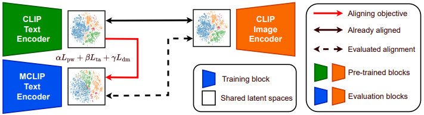
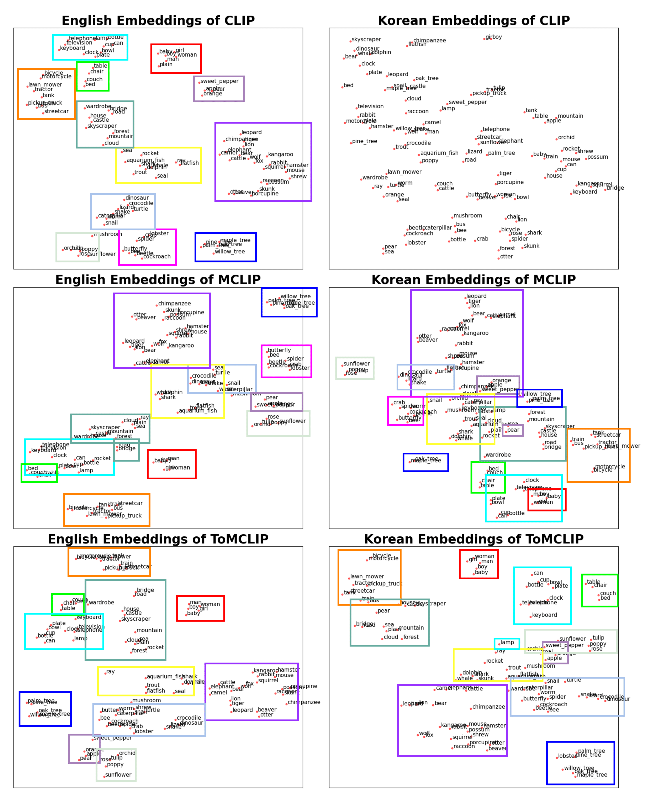

# Topological Alignment of shared Vision-Language Embedding Space (AISTATS 2026)

## Paper 
[<U>Paper link</U>](https://arxiv.org/abs/2510.10889)  


## Installation
### Environment

```bash
conda env create --file environment.yml
conda activate tomclip
```

## Training and Evaluation
### Training MCLIP, ToMCLIP(dm), ToMCLIP(ta), ToMCLIP
```bash
sh train.sh
```

### Test MCLIP, ToMCLIP(dm), ToMCLIP(ta), ToMCLIP on CIFAR100 and xFlickr&CO

For the test on xFlickr&CO, coco val2014 and flickr30k_images should be prepared.  
[**<U>COCO val2014</U>**](https://cocodataset.org/#download)  
[**<U>Flickr30k images</U>**](https://www.kaggle.com/datasets/hsankesara/flickr-image-dataset)  

```bash
sh test.sh
```

## Visualization of Shared Embedding Space
We provide a visualization of the shared embedding space for English and Korean CIFAR-100 class label embeddings. 
Each point represents the embedding of a prompted class label, and distances between points reflect semantic relationships in the embedding space.
For each model (i.e., CLIP, MCLIP, and ToMCLIP), we project the embeddings in two dimensions using t-SNE and highlight the class-level clusters. 

